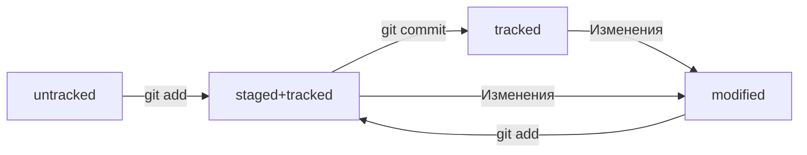

# **Проект который поможет тебе разобрать с Git**
## **Команды bash terminal**
- cd = "Изменить директорию"
- pwd = "(от англ. print working directory) возвращает путь к рабочей папке"

---
### **Хеш — идентификатор коммита**
Для того чтобы посмотреть hash последнего коммита необходим перейти в скрытую директорию в папке проекта ".git".
После этого выполнить команду "cat HEAD", что вернет путь к веткам проекта.
Затем переходим в директорию "cd /refs/head/"(которую нам вернула команда "cat HEAD").
Читаем файл master, что выведет hash.
__Git хеширует (преобразует) информацию о коммите с помощью алгоритма SHA-1 (от англ. Secure Hash Algorithm — «безопасный алгоритм хеширования») и получает для каждого коммита свой уникальный хеш — результат хеширования.__

### **Элементы описания коммита**
git log - команда, которая позволяет посмотреть информацию о коммитах
после выполнения, код вернет нам:
1. commit "hash"
2. Author 
3. Date
4. commit message
git log --oneline - команда, при которой в  терминале появятся только первые несколько символов хеша каждого коммита и их комментарии.
Чтобы выйти из git log - нажмите "q"

### **HEAD — всему голова**
(HEAD -> master)
Файл HEAD (англ. «голова», «головной») — один из служебных файлов папки .git. Он указывает на коммит, который сделан последним (то есть на самый новый).
Внутри HEAD — ссылка на служебный файл: refs/heads/master (или refs/heads/main в зависимости от названия ветки). Если заглянуть в этот файл, можно увидеть хеш последнего коммита.

### **Статусы файлов в Git**
Статусы untracked/tracked, staged и modified
* untracked (англ. «неотслеживаемый»)
    Git «видит», что такой файл существует, но не следит за изменениями в нём. У untracked-файла нет предыдущих версий, зафиксированных в коммитах или через команду git add.
* staged (англ. «подготовленный»)
    После выполнения команды git add файл попадает в staging area (от англ. stage — «сцена», «этап процесса» и area — «область»), то есть в список файлов, которые войдут в коммит. В этот момент файл находится в состоянии staged.
* tracked (англ. «отслеживаемый»)
    Состояние tracked — это противоположность untracked. Оно довольно широкое по смыслу: в него попадают файлы, которые уже были зафиксированы с помощью git commit, а также файлы, которые были добавлены в staging area командой git add. То есть все файлы, в которых Git так или иначе отслеживает изменения.
* modified (англ. «изменённый»)
    Состояние modified означает, что Git сравнил содержимое файла с последней сохранённой версией и нашёл отличия. Например, файл был закоммичен и после этого изменён.

### **Оформление сообщений к коммитам**
То, как написаны сообщения коммитов, тоже может подчиняться определённым правилам. Иногда эти правила продиктованы культурой команды, а иногда техническими ограничениями.
Есть общие рекомендации по тому, как правильно составить сообщение. Оно должно быть:
* относительно коротким, чтобы его было легко прочитать;
* информативным.

Вот пример полезного сообщения в репозитории новостного сайта: Исправление опечатки в заголовке главной страницы на хорватском. Такое сообщение даёт много информации:
* Исправление опечатки значит, что исправлена ошибка, которая была допущена при наборе. Такое исправление не меняет смысл. То есть, например, главному редактору не нужно перепроверять этот заголовок.
* На хорватском говорит о том, что переводчикам на другие языки этот коммит можно смело пропускать.
* В заголовке главной страницы указывает, где произошли изменения. Если, например, кто-то зайдёт на сайт и ему не понравится новый заголовок, он легко найдёт по истории (git log) автора этого коммита и спросит у него, почему заголовок теперь такой.

Например, правила оформления коммитов могут быть такие:
* длина сообщения от 3030 до 7272 символов;
* первое слово — глагол в инфинитиве («исправить», «дополнить», «добавить» и другие);
* и так далее.

Корпоративный
В корпоративном стиле в начале сообщения обычно указывают Jira-ID, а после — текст сообщения.
$ git commit -m "LGS-239: Дополнить список пасхалок новыми числами" 
LGS-239 значит, что это 239239-я задача в проекте LGS (сокращение от англ. logistics — «логистика»).

Стандарт Conventional Commits (англ. «соглашение о коммитах») отличается качественной документацией и подробной проработкой. Он подходит для репозиториев с исходным кодом программ. Использовать его для других типов проектов (например, для перевода книги) было бы неудобно.
Conventional Commits предлагает такой формат коммита: type : сообщение.
Первая часть type — это тип изменений. Таких типов достаточно много. Вот два примера:
* feat (сокращение от англ. feature) — для новой функциональности;
* fix (от англ. «исправить», «устранить») — для исправленных ошибок.
Более подробный список можно увидеть на сайте с [описанием этого стиля](https://www.conventionalcommits.org/ru/v1.0.0-beta.4/#%D1%81%D0%BF%D0%B5%D1%86%D0%B8%D1%84%D0%B8%D0%BA%D0%B0%D1%86%D0%B8%D1%8F)описанием этого стиля.
Например, сообщение может быть таким.
git commit -m "feat: добавить подсчёт суммы заказов за неделю" 

GitHub-стиль
Если коммит «закрывает» или «решает» какую-то задачу, то в его сообщении удобно указывать ссылку на неё. Для этого в любом месте сообщения нужно указать #<номер задачи>

[Ссылка на git руководство](https://github.com/git/git/blob/master/README.md "Прочитай меня")
    
