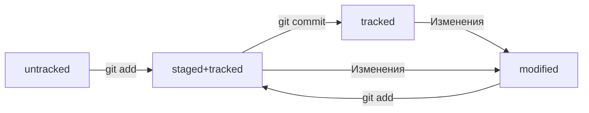

# **Проект который поможет тебе разобрать с Git**
## **Команды bash terminal**
"Изменить директорию."
```bash
cd
```
"(от англ. print working directory) Возвращает путь к рабочей папке."
```bash
pwd
```
"Выполнить unstage изменений."
```bash
git restore --staged "file"
```
"«Откатить» коммит."
```bash
git reset --hard "hash"
```
"«Откатить» изменения, которые не попали ни в staging, ни в коммит."
```bash
git restore "file"
```
"Эта команда сравнит последнюю закоммиченную версию файла с текущей (изменённой) версией."
```bash
git diff
```
"Эта команда покажет изменения в "staged"-файлах"
```bash
git diff --staged 
```
"Выводит весь полный список коммитов"
```bash
git log
```
"Выводит весь краткий список коммитов"
```bash
git log --oneline
```
"Команда которая запушит проект на гит, с флагом -f("force"-толкать") сделает это принудительно"
```bash
git push(git push -f)
```
"Сама по себе эта команда просто выводит в консоль то, что ей передали в качестве параметра."
```bash
echo
```
Добавить в файл в последнюю строку что-то"
```bash
echo >> "smth"
```
"Перезапишет файл весь файл на что-то"
```bash
echo > "smth"
```
"(от англ. super user do) Выполнить действие от администратора"
```bash
sudo
```
"Клонировать репозиторий"
```bash
git clone "ssh-key"
```
"Проверка, что репозитории связаны"
```bash
git remote -v
```
"Копировать данные из файла"
```bash
pbcopy < file.txt
```
"Вставить данные из файла"
```bash
pbpaste
```
"Просмотреть ветки проекта"
```bash
git branch
```
"Просмотреть ветки проекта(как удаленные, так и локальные)"
```bash
git branch -a
```
"команда git add с флагом-точкой подготовит к сохранению текущую папку"
```bash
git add .
```
"Создать ветку"
```bash
git branch "branch_name"
```
"Переключиться на другую ветку"
```bash
git checkout "название ветки"
```
"Создать и переключиться на другую ветку( -b - от англ branch)"
```bash
git checkout -b название ветки"
```
"Сравнить ветки "
```bash
git diff "название_ветки1" "название_ветки2"
```
"Слить ветки"
```bash
git merge "название_ветки"
```
"Удалить ветку принудительно"
```bash
git branch -D "название_ветки"
```
"Удалить ветку аккуратно"
```bash
git branch -d "имя_ветки"
```
"Связать удаленный и локальный репозиторий"
```bash
git remote add origin git@github.com:%ИМЯ_АККАУНТА%/git-branches.git
```
"Разорвать удаленный и локальный репозиторий"
```bash
git remote remove origin git@github.com:%ИМЯ_АККАУНТА%/git-branches.git
```
"Запушить ветку в удалённый репозитория и одновременно связать локальную с удаленной, а вместо пароля API TOKEN"
```bash
git push -u origin "master or feature/merge-request or etc."
```
"Подтянуть изменения из удалённого репозитория"
```bash
git pull 
```
"Cвязать локальную ветку с удалённой(Флаг --set-upstream — это «полная», или «длинная», версия флага -u. А HEAD здесь — это синоним текущей ветки.)"
```bash
git push --set-upstream origin HEAD
```

---


## **Шпарагалка**

### Инициализация репозитория
git init (от англ. initialize, «инициализировать») — инициализируй репозиторий.

### Синхронизация локального и удалённого репозиториев
git remote add origin https://github.com/YandexPracticum/first-project.git (от англ. remote, «удалённый» + add, «добавить») — привяжи локальный репозиторий к удалённому с URL https://github.com/YandexPracticum/first-project.git;<br/>
git remote -v (от англ. verbose, «подробный») — проверь, что репозитории действительно связались<br/>
git push -u origin main (от англ. push, «толкать») — в первый раз загрузи все коммиты из локального репозитория в удалённый с названием origin.

Ваша ветка может называться master, а не main. Подправьте команду, если это необходимо.

git push (от англ. push, «толкать») — загрузи коммиты в удалённый репозиторий после того, как он был привязан с помощью флага -u.

### Подготовка файла к коммиту
git add todo.txt (от англ. add, «добавить») — подготовь файл todo.txt к коммиту;<br/>
git add --all (от англ. add, «добавить» + all, «всё») — подготовь к коммиту сразу все файлы, в которых были изменения, и все новые файлы;<br/>
git add . — подготовь к коммиту текущую папку и все файлы в ней.

### Создание и публикация коммита
git commit -m "Комментарий к коммиту." (от англ. commit, «совершать», фиксировать» + message, «сообщение») — сделай коммит и оставь комментарий, чтобы было проще понять, какие изменения сделаны;<br/>
git push (от англ. push, «толкать») — добавь изменения в удалённый репозиторий.

### Просмотр информации о коммитах
git log (от англ. log, «журнал [записей]») — выведи подробную историю коммитов;<br/>
git log --oneline (от англ. log, «журнал [записей]» + oneline, «одной строкой») — покажи краткую информацию о коммитах: сокращённый хеш и сообщение.

### Просмотр состояния файлов
git status (от англ. status, «статус», «состояние») — покажи текущее состояние репозитория.

### Добавление изменений в последний коммит
git commit --amend --no-edit (от англ. amend, «исправить») — добавь изменения к последнему коммиту и оставь сообщение прежним;<br/>
git commit --amend -m "Новое сообщение" — измени сообщение к последнему коммиту на Новое сообщение.

Выйти из редактора Vim: нажать Esc, ввести :qa!, нажать Enter.

### «Откат» файлов и коммитов
git restore --staged hello.txt (от англ. restore, «восстановить») — переведи файл hello.txt из состояния staged обратно в untracked или modified;<br/>
git restore hello.txt — верни файл hello.txt к последней версии, которая была сохранена через git commit или git add;<br/>
git reset --hard b576d89 (от англ. reset, «сброс», «обнуление» + hard, «суровый») — удали все незакоммиченные изменения из staging и «рабочей зоны» вплоть до указанного коммита.

### Просмотр изменений
git diff (от англ. difference, «отличие», «разница») — покажи изменения в «рабочей зоне», то есть в modified-файлах;<br/>
git diff a9928ab 11bada1 — выведи разницу между двумя коммитами;<br/>
git diff --staged — покажи изменения, которые добавлены в staged-файлах.


---


## **Шпаргалка. Работа с ветками**

### Feature branch workflow
Самый популярный подход к работе с Git в команде — это feature branch workflow. В нём создают ветку для каждой задачи (например, для новой функциональности или исправления бага), а когда всё готово, вливают новую ветку в main.

Важные этапы этого процесса — пул-реквест и ревью изменений. Пул-реквест — это интерфейс, в котором можно обсудить изменения. Ревью — просмотр изменений другими участниками и один из способов проверить качество таких изменений.

Если вы уже участник проекта (или collaborator в терминах GitHub), можно клонировать репозиторий напрямую. А если нет, нужно предварительно сделать «форк». Также для участников доступна кнопка Merge после ревью, а для неучастников — нет.

### Конфликты слияния
Когда один и тот же файл меняется в нескольких ветках, при их слиянии может произойти конфликт. Пугаться конфликтов не нужно, это нормальная часть работы с системами контроля версий. IDE, вроде VSCode или Intellij IDEA, помогут «склеить» файл из двух конфликтующих версий.

### Алгоритм-шпаргалка для создания PR
1. Cклонировать репозиторий.
        Если вы не участник проекта, предварительно сделать «форк» исходного репозитория.
        На странице репозитория или «форка» нажать кнопки: Code → SSH → скопировать ссылку.
        Выполнить команду git clone <ссылка на репозиторий>.
2. Создать ветку для вашей задачи: git checkout -b my-task-branch-name.
3. Добавить и «закоммитить» изменения, которые вы хотите внести в проект.
4. «Запушить» ветку: git push --set-upstream origin HEAD или git push -u origin my-task-branch-name.
        GitHub (с помощью Git) выведет ссылку на создание PR. По ней нужно перейти.
        PR можно также создать через интерфейс GitHub.
5. Сообщить о пул-реквесте ревьюеру.
        Иногда ревьюеры назначаются автоматически, тогда сообщать не нужно.
6. Обсуждать с ревьюером предлагаемые изменения и вносить правки, пока эти изменения не будут одобрены (пока не будет получен «апрув»).  
        Если кто-то добавил конфликтующие изменения в main, пока ваш PR был на ревью, нужно разрешить конфликт:  
            * Обновить main: git checkout main && git pull.
            * Влить main в свою ветку: git checkout my-task-branch-name && git merge main.
            * Разрешить конфликты слияния с помощью IDE или вручную.
            * Создать коммит слияния: git commit --no-edit или git commit -m 'merge main'.
            * Сделать git push своей ветки.
7. Нажать кнопку Merge или подождать, пока её нажмёт кто-то ещё.
8. Ещё раз обновить main, чтобы «подтянуть» ваши изменения в основную ветку локального репозитория: git checkout main && git pull.
9. Вы великолепны! Можете начинать снова со второго пункта.

### Алгоритм-шпаргалка для разрешения конфликтов слияния
1. Открыть проект в IDE (VS Code, IDEA или другие).
2. Открыть файл, в котором есть конфликт.
3. Выбрать, какие части файла нужно взять из одной ветки, а какие — из другой.
4. Когда конфликты разрешены, сделать коммит: git commit --no-edit или git commit -m 'merge branch <название ветки>'.

---


### Клонирование чужого репозитория
git clone git@github.com:YandexPraktikum/first-project.git (от англ. clone, «клон», «копия») — склонируй репозиторий с URL first-project.git из аккаунта YandexPraktikum на мой локальный компьютер.

### Создание веток
git branch feature/the-finest-branch (от англ. branch, «ветка») — создай ветку от текущей с названием feature/the-finest-branch;

### Навигация по веткам
git branch (от англ. branch, «ветка») — покажи, какие есть ветки в репозитории и в какой из них я нахожусь (текущая ветка будет отмечена символом *);

git branch -a — покажи все известные ветки, как локальные (в локальном репозитории), так и удалённые (в origin, или на GitHub).

git checkout feature/br — переключись на ветку feature/br.

### Сравнение веток
git diff main HEAD (от англ. difference, «отличие», «разница») — покажи разницу между веткой main и указателем на HEAD;

git diff HEAD~2 HEAD — покажи разницу между тем коммитом, который был два коммита назад, и текущим.

### Удаление веток
git branch -d br-name — удали ветку br-name, но только если она является частью main;

git branch -D br-name — удали ветку br-name, даже если она не объединена с main.

### Слияние веток
git merge main (от англ. merge, «сливать», «поглощать») — объедини ветку main с текущей активной веткой. 

### Работа с удалённым репозиторием
git push -u origin my-branch (от англ. push, «толкнуть», «протолкнуть») — отправь новую ветку my-branch в удалённый репозиторий и свяжи локальную ветку с удалённой, чтобы при дополнительных коммитах можно было писать просто git push без -u;

git push my-branch — отправь дополнительные изменения в ветку my-branch, которая уже существует в удалённом репозитории;

git pull (от англ. pull, «вытянуть») — подтяни изменения текущей ветки из удалённого репозитория.

git checkout -b feature/the-finest-branch — создай ветку feature/the-finest-branch и сразу переключись на неё.


---


## Шпаргалка. Командная работа в Git

## **Хеш — идентификатор коммита**
Для того чтобы посмотреть hash последнего коммита необходим перейти в скрытую директорию в папке проекта ".git".
После этого выполнить команду "cat HEAD", что вернет путь к веткам проекта.
Затем переходим в директорию "cd /refs/head/"(которую нам вернула команда "cat HEAD").
Читаем файл master, что выведет hash.

Git хеширует (преобразует) информацию о коммите с помощью алгоритма SHA-1 (от англ. Secure Hash Algorithm — «безопасный алгоритм хеширования») и получает для каждого коммита свой уникальный хеш — результат хеширования.


## **Элементы описания коммита**
git log - команда, которая позволяет посмотреть информацию о коммитах
после выполнения, код вернет нам:
1. commit "hash"
2. Author 
3. Date
4. commit message<br/>
git log --oneline - команда, при которой в  терминале появятся только первые несколько символов хеша каждого коммита и их комментарии.
Чтобы выйти из git log - нажмите "q"


## **HEAD — всему голова**
(HEAD -> master)
Файл HEAD (англ. «голова», «головной») — один из служебных файлов папки .git. Он указывает на коммит, который сделан последним (то есть на самый новый).
Внутри HEAD — ссылка на служебный файл: refs/heads/master (или refs/heads/main в зависимости от названия ветки). Если заглянуть в этот файл, можно увидеть хеш последнего коммита.


## **Статусы файлов в Git**
Статусы untracked/tracked, staged и modified
* untracked (англ. «неотслеживаемый»)
    Git «видит», что такой файл существует, но не следит за изменениями в нём. У untracked-файла нет предыдущих версий, зафиксированных в коммитах или через команду git add.
* staged (англ. «подготовленный»)
    После выполнения команды git add файл попадает в staging area (от англ. stage — «сцена», «этап процесса» и area — «область»), то есть в список файлов, которые войдут в коммит. В этот момент файл находится в состоянии staged.
* tracked (англ. «отслеживаемый»)
    Состояние tracked — это противоположность untracked. Оно довольно широкое по смыслу: в него попадают файлы, которые уже были зафиксированы с помощью git commit, а также файлы, которые были добавлены в staging area командой git add. То есть все файлы, в которых Git так или иначе отслеживает изменения.
* modified (англ. «изменённый»)
    Состояние modified означает, что Git сравнил содержимое файла с последней сохранённой версией и нашёл отличия. Например, файл был закоммичен и после этого изменён.




## **Оформление сообщений к коммитам**
То, как написаны сообщения коммитов, тоже может подчиняться определённым правилам. Иногда эти правила продиктованы культурой команды, а иногда техническими ограничениями.
Есть общие рекомендации по тому, как правильно составить сообщение. Оно должно быть:
* относительно коротким, чтобы его было легко прочитать;
* информативным.

Вот пример полезного сообщения в репозитории новостного сайта: Исправление опечатки в заголовке главной страницы на хорватском. Такое сообщение даёт много информации:
* Исправление опечатки значит, что исправлена ошибка, которая была допущена при наборе. Такое исправление не меняет смысл. То есть, например, главному редактору не нужно перепроверять этот заголовок.
* На хорватском говорит о том, что переводчикам на другие языки этот коммит можно смело пропускать.
* В заголовке главной страницы указывает, где произошли изменения. Если, например, кто-то зайдёт на сайт и ему не понравится новый заголовок, он легко найдёт по истории (git log) автора этого коммита и спросит у него, почему заголовок теперь такой.

Например, правила оформления коммитов могут быть такие:
* длина сообщения от 3030 до 7272 символов;
* первое слово — глагол в инфинитиве («исправить», «дополнить», «добавить» и другие);
* и так далее.

Корпоративный
В корпоративном стиле в начале сообщения обычно указывают Jira-ID, а после — текст сообщения.
$ git commit -m "LGS-239: Дополнить список пасхалок новыми числами" 
LGS-239 значит, что это 239239-я задача в проекте LGS (сокращение от англ. logistics — «логистика»).

Стандарт Conventional Commits (англ. «соглашение о коммитах») отличается качественной документацией и подробной проработкой. Он подходит для репозиториев с исходным кодом программ. Использовать его для других типов проектов (например, для перевода книги) было бы неудобно.
Conventional Commits предлагает такой формат коммита: type : сообщение.
Первая часть type — это тип изменений. Таких типов достаточно много. Вот два примера:
* feat (сокращение от англ. feature) — для новой функциональности;
* fix (от англ. «исправить», «устранить») — для исправленных ошибок.
Более подробный список можно увидеть на сайте с [описанием этого стиля](https://www.conventionalcommits.org/ru/v1.0.0-beta.4/#%D1%81%D0%BF%D0%B5%D1%86%D0%B8%D1%84%D0%B8%D0%BA%D0%B0%D1%86%D0%B8%D1%8F).
Например, сообщение может быть таким.
git commit -m "feat: добавить подсчёт суммы заказов за неделю" 

GitHub-стиль<br/>
Если коммит «закрывает» или «решает» какую-то задачу, то в его сообщении удобно указывать ссылку на неё. Для этого в любом месте сообщения нужно указать #<номер задачи>


## **Просматриваем изменения в файлах**
Самое важное git diff выводит в конце:
- красный цвет строки никого нет значит, что эта строка была удалена;
- зелёный цвет строки Мышка-норушка значит, что она была добавлена.

Коротко разберём остальные строки вывода команды:

- Первые две строки (diff --git a/... b/... и index 901da07..ac459e1 100644) — это низкоуровневая техническая информация. Мы не будем на ней останавливаться.
- Строки --- a/teremok.txt и +++ b/teremok.txt говорят, что дальше будет выведен результат сравнения файлов a/teremok.txt и b/teremok.txt — исходной и текущей версий.
- Строка @@ -1,2 +1,2 @@ сообщает, какие строки файла попали в сравнение. Выражение 1,2 (неважно, с плюсом или с минусом) говорит, что были использованы две строки, начиная с первой. Если бы было, например, написано +15,7, это значило бы, что в сравнении участвуют 77 строк, начиная с 1515-й.
- Выражение со знаком минус (-1,2) относится к «оригинальной» версии файла (a/teremok.txt), а со знаком плюс (+1,2) — к «изменённой» (b/teremok.txt).


## **Игнорирование файлов в Git**
Чтобы Git игнорировал ненужные файлы и не пытался добавить их в репозиторий, нужно создать файл .gitignore (от англ. ignore — «игнорировать») и записать в него названия игнорируемых файлов.
### Как заполнить .gitignore
В простейшем случае в .gitignore указывают все файлы, которые нужно игнорировать (по одному имени на строку). Но часто удобнее использовать шаблоны. Шаблон, или правило, — это способ указать сразу на несколько файлов с однотипными названиями.
Правила из .gitignore применяются только к новым (untracked) файлам. Если файл уже попал в staging area или в коммит, то правила на него не распространяются.

Разберём подробнее формат файла .gitignore, какие в нём могут встречаться строки и как выглядят шаблоны.

#### Комментарий
Если строка начинается с #, то это комментарий, и .gitignore не будет его учитывать.
```bash
# вот так можно писать комментарии;
# они ничего не значат для .gitignore,
# но они могут быть полезны, чтобы понять, зачем было добавлено то или иное правило
```

#### Просто название файла
Допустим, нужно, чтобы Git игнорировал все файлы .DS_Store. Для этого достаточно добавить в .gitignore строку с названием файла.
```bash
# для macOS
.DS_Store
```
В таком случае Git будет игнорировать файлы с именем .DS_Store, причём не только в корне репозитория, но и во всех вложенных папках.

#### Звёздочка (*)
Символ звёздочки (*) соответствует любой строке, включая пустую. Если такой символ используется в шаблоне в .gitignore, значит, файл будет проигнорирован вне зависимости от того, что будет на месте звёздочки.
```bash
# игнорировать все файлы, которые заканчиваются на .jpeg
*.jpeg

# игнорировать все файлы "tmp" во всех подпапках папки docs
docs/*/tmp
```
Если задать правило, которое состоит только из звёздочки, Git будет игнорировать все файлы. Это происходит потому, что под звёздочку подходит любое имя файла.

#### Вопросительный знак (?)
Вопросительный знак ? соответствует одному любому символу.
```bash
file?.txt
```
Если сохранить такую запись в .gitignore, то будут проигнорированы, например, файлы fileA.txt и file1.txt. А вот файл file12.txt не будет проигнорирован, потому что в его названии два символа после file, а не один.

#### Квадратные скобки ([…])
Квадратные скобки, как и вопросительный знак, соответствуют одному символу. При этом символ не любой, а только из списка, который указан в скобках.
```bash
# игнорировать файлы file0.txt, file1.txt и file2.txt
# при этом не игнорировать file3.txt, file4.txt, ...
file[0-2].txt
```
В скобках можно либо перечислить символы (abc), либо задать диапазон (a-z).

#### Слеш (/)
Косая черта, или слеш (/), указывает на каталоги. Если шаблон в .gitignore начинается со слеша, то Git проигнорирует файлы или каталоги только в корневой директории.
```bash
# игнорировать todo.txt в корне репозитория
/todo.txt

# для сравнения: spam.txt будет игнорироваться во всех папках
spam.txt
```
Теперь файл todo.txt в корневом каталоге будет проигнорирован. При этом, например, файл subdir/todo.txt по-прежнему отслеживается.
Если шаблон заканчивается слешем, то правило применится только к папке.
```bash
# игнорировать папку build
build/
```
Обратите внимание: если build — это папка, то она будет проигнорирована. Если build — обычный файл, то он не подпадёт под правило и не будет игнорироваться.

#### Парные звёздочки (**)
Функция парных звёздочек (**) похожа на функцию одинарной (*). Отличие в том, как они работают с вложенными папками. Двойная звёздочка может соответствовать любому количеству таких папок (в том числе нулю). Одинарная может соответствовать только одной.
```bash
# игнорировать файлы "docs/current/tmp", "docs/old/tmp",
# а также "docs/old/saved/a/b/c/d/tmp"
# и даже "docs/tmp", потому что ноль вложенных папок тоже подходит
docs/**/tmp

# игнорировать только "docs/current/tmp" и "docs/old/tmp"
# файл "docs/old/saved/a/b/c/d/tmp" не попадает в правило
docs/*/tmp
```
Для двойной звёздочки верно то же самое, что и для одной: если задать правило **, то будут проигнорированы все файлы.

#### Восклицательный знак (!)
Любое правило в файле .gitignore можно инвертировать с помощью восклицательного знака (!).
```bash
# игнорировать все JPEG-файлы
*.jpeg

# но только не мем с Doge
!doge.jpeg
```
Теперь файл doge.jpeg будет отслеживаться, хотя остальные jpeg-файлы будут проигнорированы. Такие правила удобны для добавления исключений из других правил .gitignore.

### .gitignore и git status
Игнорируемые файлы не отображаются в выводе команды git status, иначе они бы засоряли вывод.
Если всё же нужно отобразить все игнорируемые файлы, то это можно сделать с помощью ключа --ignored: git status --ignored. В таком случае в выводе git status появится раздел Ignored files.

## **Что такое Fork**
Fork (англ. «развилка», «ответвление»), или «форк», — это GitHub-операция; напрямую с Git она не связана. «Форк» создаёт копию репозитория в аккаунте GitHub. Такая копия будет полностью независима. Изменения, которые вы внесёте, не будут синхронизированы с исходным репозиторием.
В процессе «форка» создаётся копия всех файлов, истории коммитов и веток. Эта копия сохраняется в вашей учётной записи GitHub.
Вот некоторые из распространённых причин использования «форков»:

* Вы хотите внести свой вклад в проект (например, open source), но не имеете прав на изменение исходного репозитория. Тогда вы можете сделать «форк», добавить нужные правки, а затем отправить запрос на включение этих изменений в оригинальный проект.<br/>
* Вы хотите развивать проект независимо от исходного. Допустим, создатели проекта решили, что не будут добавлять функциональность, которая вам необходима. В таком случае вы можете сделать «форк» и добавить её самостоятельно.<br/>

##  **Как назвать новую ветку**
Есть разные подходы к наименованию веток. Каждая команда разработки выбирает свой. Но независимо от подхода ветки нужно называть так, чтобы другим участникам было понятно, что в них происходит.
Мы будем использовать указатели feature (англ. «особенность», «деталь») для веток, где прорабатывается новая функциональность, и bugfix (от англ. bug — «жук», «ошибка» и fix — «исправить») для веток, где ведётся работа по исправлению ошибок.
После ключевого слова идёт слеш и описание проблемы или задачи (например, /add-branch-info). Это описание не должно содержать пробелов — следует использовать нижнее подчёркивание или дефис. В наших примерах мы будем использовать дефис.

## **Суффикс навигации ~ **
Для облегчения этой задачи в Git есть суффикс навигации ~N, где N — это число. Он отсчитывает от заданного коммита N коммитов назад во времени. Нумерация начинается с нуля: commit~0 — это сам коммит, commit~1 — предыдущий, commit~2 — предшествующий предыдущему и так далее.
Например, HEAD~1 — это следующий за текущим коммит. А main~5 — это пятый коммит в ветке main, если считать с последнего выполненного коммита.
На практике чаще нужен либо текущий коммит (HEAD), либо следующий за ним (HEAD~1). Для ~1 есть специальное сокращение ~ (без числа). То есть вместо HEAD~1 обычно пишут просто HEAD~.


## **Объединяем и удаляем ветки**

### Выполнить слияние — git merge <название_ветки>
Перед тем как начать процесс слияния, нужно перейти в ветку, куда должны добавиться изменения. Обычно это главная ветка. Перейдите в неё и вызовите команду git merge с именем присоединяемой ветки feature/diff в качестве параметра.
Объединение веток прошло успешно! Все коммиты из feature/diff добавлены в главную ветку. В сообщении после слияния содержится следующая информация:
* Updating 079cfbf..f30d441 — значит, что коммиты c 079cfbf по f30d441 были объединены.
* Fast-forward — это режим слияния. Fast-forward (англ. «перемотка») значит, что итогом слияния будет линейная история коммитов. Такое происходит, когда истории двух веток находятся на одной прямой — то есть когда одна ветка продолжает историю, начатую другой, как в нашем примере.
* Информация о конкретных изменениях. В нашем примере поменялся файл README.md (1 file changed): в нём теперь две новые строки (2 insertions(+)).

### Удалить ветку после объединения — git branch -D <название_ветки>
После того как произошло слияние, ветку-донора можно удалить. Для этого в основной ветке введите команду git branch с флагом -D (от англ. delete — «удалить») и названием ветки.
Если в момент удаления вы будете находиться в той ветке, которую хотите удалить, Git сообщит об ошибке: can not delete branch (англ. «не получается удалить ветку»).
Удаление локальной ветки через Git не удаляет ветку на GitHub!


## **Создаём pull request**
В процессе командной работы следует внимательно следить за изменениями в файлах. Нельзя просто внести правки в своей ветке и сразу залить её в основную. Сначала ваши коллеги должны убедиться, что предложенные вами изменения логичны и эффективны.

Для этого используют механизм pull request (англ. «запрос на изменения»; буквально: «запрос на подтягивание»). В обиходе его обычно так и называют — «пул-реквест», или ещё короче — ПР или PR. Алгоритм такой:
1. Вы трудитесь над задачей в своей ветке — например, пишете код новой функциональности.
2. Вы заканчиваете работу, а затем создаёте пул-реквест.
3. Ваши коллеги проверяют, что код выглядит аккуратно и лаконично, а программа работает корректно; также оставляют комментарии. Этот процесс называют code review (англ. «рассмотрение кода»), или просто ревью.
4. После финального согласования вы заливаете свою ветку в основную.

### Из чего состоит pull request и чем он может обернуться
У каждого пул-реквеста есть:
* Название — краткое описание предлагаемых изменений. Например: Адаптивный заголовок сайта, Замена альбома на галерею и так далее.
* Описание — развёрнутое описание изменений. Это поле заполнять необязательно, но желательно.
* Исходная ветка — та, в которой вы работали. Например, feature/merge-request.
* Целевая ветка — основная ветка проекта, в которую вы хотите внести изменения.

Где заполнять эти параметры, вы увидите далее — в ходе тренировки. Также у каждого пул-реквеста может быть два исхода:
* merge (англ. «соединить») — предлагаемые изменения приняты; код вливается в целевую ветку; пул-реквест закрывается.
* close (англ. «закрыть») — пул-реквест закрывается без слияния изменений.


## Забираем изменения из удалённого репозитория

### Забрать изменения из удалённого репозитория — git pull
Чтобы скачать изменения из удалённого репозитория, следует выполнить команду git pull (от англ. pull — «вытянуть») — стянуть, или «запулить» изменения.

Алгоритм такой. Сначала нужно перейти в локальный репозиторий и убедиться, что вы находитесь в правильной ветке, — как правило, это основная ветка main (или master). Затем можно ввести команду.

Обычно git pull — это первая команда, которую вводит разработчик, как только открывает код проекта, чтобы начать с ним работать.

Дополнительно git pull и git merge выполняют перед тем, как создать пул-реквест. При командной работе, особенно в больших командах, основная ветка часто успевает «убежать» вперёд, пока вы подготавливаете свои изменения. Поэтому перед созданием пул-реквеста рекомендуется сначала подтянуть изменения из основной ветки, объединить их с вашей, решить все возможные конфликты и лишь затем сделать push.<br/>
```bash
$ git checkout main # перешли в main
$ git pull # подтянули новые изменения в main
$ git checkout my-branch # вернулись в рабочую ветку my-branch
$ git merge main # влили main в новую ветку my-branch
$ git push -u origin my-branch # отправили ветку my-branch в удалённый репозиторий
```

### Можно ли отключить fast-forward
Fast-forward слияние веток можно отключить флагом --no-ff. Например: git merge --no-ff add-docs.

Также его можно отключить «навсегда» (до тех пор, пока вы не вернёте настройку «как было») с помощью настройки merge.ff: git config [--global] merge.ff false.

Чаще всего сообщения к коммитам слияния не редактируют и оставляют «как предложил Git». Для таких случаев удобен флаг --no-edit: git merge --no-edit %another_branch%.


## git push и fast-forward

### Пара слов о rebase
В Git можно решить проблему «разошедшихся» веток с помощью операции rebase (англ. «перебазирование»). Эта операция позволяет изменить точку (коммит), от которой отделилась ветка.

### Пара слов о git push --force
В этом случае команда git push --force просто «выкинет» (удалит) коммит D и запишет в main@origin коммиты из main. Вот что получится.

## Модели веток. Простая feature branch модель

### Подходы
Рассмотрим три самых популярных подхода — их также принято называть workflow (англ. «рабочий процесс») или сокращённо: flow.
* Feature branch workflow — простой и самый популярный вариант. Если коротко, в нём для каждого нового изменения создаётся новая ветка, которая позже вливается в main с помощью git merge.
* Git flow — более сложный вариант. Подход похож на feature branch workflow, но в нём создаётся больше веток, а изменения (коммиты) делят на разные типы: исправление, новая функциональность и так далее. Разные типы коммитов попадают в разные ветки.
* Trunk-based — популярный в больших компаниях (таких как Яндекс, Google и прочих) подход, который обещает бо́льшую скорость работы в крупных командах. Этот подход тоже похож на feature branch workflow. Главное отличие в том, что участники проекта вливают (merge) свой код в основную ветку максимально часто. Например, каждый день.

## Pull request и code review

### Pull (или merge) request
В большинстве команд новые функциональности и исправления попадают в main через запрос на слияние (англ. pull request, или merge request). Его так и называют — пул-реквест или мёрж-реквест. В переводе с языка Git это значит: «Вот моя ветка, хочу «вмёржить» её в main».

Если ревьюеров всё устраивает, они нажимают кнопку Approve (от англ. "вердикт")(англ. «согласовать», «одобрить»). Иногда вместо кнопки используется комментарий-аббревиатура LGTM (англ. Looks Good To Me — «на мой взгляд, всё хорошо»).
После одобрения пул-реквеста его автор (или один из участников проекта) может нажать кнопку Merge. Тогда GitHub (или GitLab/BitBucket) вольёт feature-ветку в main. В зависимости от настроек система также предложит удалить саму feature-ветку, потому что она уже не нужна: все изменения есть в main после слияния.

В этом уроке мы рассмотрели жизненный цикл одного пул-реквеста. Всё происходит так:
1. Автор создаёт пул-реквест.
2. Ревьюер просматривает изменения и предлагает правки, если они необходимы.
3. Автор вносит исправления по комментариям ревьюера.
4. Второй и третий пункты могут повториться!
5. Если ревьюера всё устраивает, он одобряет («апрувит») пул-реквест.
6. Вуаля! Теперь автор или ревьюер могут влить изменения в основную ветку.

### Работа с PR: soft skills
Навыки специалиста принято делить на две группы: hard skills (англ. «жёсткие навыки») и soft skills (англ. «мягкие навыки», «гибкие навыки»).
* Hard skills, или хардскилы, — это владение инструментами, причём неважно какими. Умение забивать гвозди молотком, знание команд Git, умение играть на пианино — всё это примеры хардскилов. Именно этому типу навыков мы уделяли больше внимания в нашем курсе.
* Soft skills, или софтскилы, — это социально-психологические навыки. Например: умение договариваться, умение внятно донести свои мысли или понять идеи собеседника, умение мягко преподнести критику результатов работы.

### Цель ревью — улучшить проект
Все участники процесса рассуждают по-разному, и понять ход мысли другого не всегда легко. Автору пул-реквеста может казаться, что «изменения очевидны и необходимы», а ревьюер может просто не понять, какой была задумка. Это может привести к непониманию и конфликтам.

Важно помнить про конечную цель любого пул-реквеста: внести в проект полезные изменения. Вот несколько общих советов:
* При обсуждении PR старайтесь вносить конструктивные предложения, не стесняйтесь задавать уточняющие вопросы или просить ссылки на практики и примеры.
* Будьте гибки. Одна из целей ревью — сделать код понятным и привести его к стандартам конкретной команды. Иногда вам может показаться, что эти стандарты противоречат вашим знаниям о правильной реализации чего-либо.
* Обращайте внимание как на свой стиль общения, так и на стиль общения других участников. Если вы считаете, что тон комментариев коллег неприемлем, не бойтесь сказать об этом.

### С точки зрения ревьюера
В ходе ревью ревьюеру важно не только показать техническое мастерство, но и проявить свои социально-психологические навыки.
* Ревьюер должен уметь выражать мысли понятно и вежливо, чтобы не вызвать у автора пул-реквеста неприятных эмоций. Многим людям свойственно чувствительно относиться к критике результата своего труда.
* В процессе ревью может понадобиться отклонить часть кода, которую написал разработчик. Важно уметь объяснить, почему это необходимо, а также предложить альтернативное решение. Критика должна применяться исключительно к предлагаемым изменениям, а не к личности их автора.
* Ревьюер должен помнить, что его задача — помочь улучшить качество кода, а не унизить разработчика или показать своё интеллектуальное превосходство. Умение договариваться и слушать собеседника — важные инструменты, которые в этом помогут.
* Ревьюер должен быть готов искать компромиссы, а также вести себя профессионально и уважительно в любой ситуации.

### С точки зрения автора пул-реквеста
Автору пул-реквеста не менее, чем ревьюеру, важно развивать и применять софтскилы. Ревьюеры тратят время и усилия, чтобы помочь автору улучшить его код. Поэтому постарайтесь подготовить свой пул-реквест так, чтобы его было легко понять и принять.
* Прежде чем создать пул-реквест, убедитесь, что вы сделали всё необходимое, чтобы подготовить его к ревью. Ещё раз просмотрите изменения самостоятельно, а также проверьте сообщения к коммитам. Также, например, если ваши правки не прошли автотесты, отправлять код на ревью не имеет смысла: ревьюер не примет его.
* Когда вы отправляете пул-реквест, дайте ревьюеру достаточно времени на его изучение. Будьте готовы ответить на любые вопросы, которые могут возникнуть во время ревью.
* Не забывайте, что ревьюеры тоже могут ошибаться. Если вы считаете, что ревьюер неправильно понял ваш код или ваше решение, не бойтесь объяснить свою позицию и предоставить дополнительную информацию.

## Разрешение конфликта вручную и через vimdiff
В этой теме поговорим о конфликтах слияния. Они могут случиться при слиянии веток (merge), если один и тот же файл был изменён в обеих ветках. Git не может сам решить, какая версия файла «правильная», а какая нет.

Такие конфликты нередко возникают в командной работе. В этом уроке покажем, как разрешать их вручную и через консоль.

### Разрешаем конфликт вручную
При попытке объединить ветки или применить изменения из удалённого репозитория Git добавит в файлы специальные маркеры конфликта. Убедитесь в этом. Откройте файл readme.md в графическом интерфейсе или выполните cat readme.md. Вы увидите следующее.
Git разметил файл. Получившиеся секции содержат изменения из каждой ветки:
* Текст между <<<<<<< HEAD и ======= указывает на изменения, которые находятся в HEAD — в данном случае это ветка main. Здесь окажутся только те строки, в которых есть конфликт.
* Текст между ======= и >>>>>>> br2 показывает на изменения, которые находятся в ветке br2.

### Разрешаем конфликт через инструмент слияния vimdiff
Разрешение конфликтов вручную — долгий и трудоёмкий процесс. Чтобы упростить эту задачу, можно использовать инструменты слияния (англ. mergetool).

В ходе курса вы наверняка не раз сталкивались с редактором Vim в консоли. Он также предоставляет инструмент слияния, который называется vimdiff. Чтобы его вызвать, при возникновении конфликта нужно выполнить команду git mergetool.

Вот что происходит на этом видео:
1. Первая большая команда — это пять команд из начала урока. Они объединены через &&. Символ \ в конце консольной команды позволяет продлить её на следующую строку.
2. Имитируем конфликт из урока и вызываем vimdiff командой git mergetool.
3. После сообщения в консоли Hit return to start merge resolution tool (vimdiff) (англ. «нажмите „вернуть“, чтобы запустить инструмент разрешения конфликтов»), нажимаем Enter, чтобы открыть vimdiff.
4. vimdiff показывает четыре окна:
        в верхнем левом углу — текущая версия файла в HEAD;
        в правом верхнем углу — версия из ветки br2;
        посередине сверху — версия из ветки, которая является общим предком, то есть из main;
        снизу — результат изменения с маркерами конфликта.
5. vimdiff создаёт копию конфликтного файла с маркерами изменений и расширением .orig. Этот файл можно удалить после слияния.
6. После успешного слияния выполняем коммит. Он станет коммитом слияния.
7. Команды git gl не существует в Git. Это сокращённая запись, которую можно создать для любой команды через механизм alias (англ. «псевдоним»). Подробнее о нём можно почитать в документации.
     
     Вызов git gl превращается в вызов git log с несколькими параметрами: git log --oneline --abbrev-commit --graph --date=short --pretty=format:'%h - %an, %cd : %s'. У каждого флага своя функция. --abbrev-commit покажет только первые несколько символов из хеша коммита; --graph выведет результат в виде графа; --date=short выведет дату в формате yyyy-MM-dd, например 2023-07-12; --pretty=format:'%h - %an, %cd : %s' задаёт формат выдачи результата.
     

# __Полезный ссылки__
- [Ссылка на git руководство](https://github.com/git/git/blob/master/README.md "Прочитай меня")
- [Ссылка на оформление md-файлов](https://gist.github.com/Jekins/2bf2d0638163f1294637)
- [Ссылка на AWS](https://aws.amazon.com/ru/)
- [Как фиксить конфликт через vimdiff](https://code.s3.yandex.net/BasicsOfGit/conflictManualOrVimdiff/1_solve_conflict.mp4)

alias pbcopy="xclip -selection clipboard"
alias pbpaste="xclip -selection clipboard -o"

